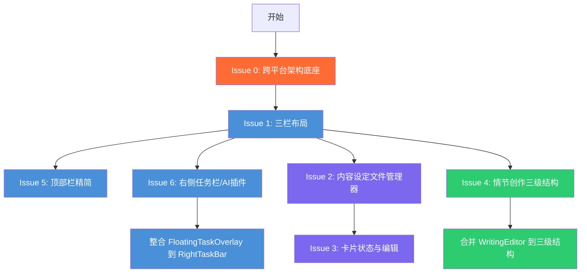

# UI 与功能重构计划

## 概述

基于用户需求，对项目进行界面布局、内容设定、情节创作、右侧任务栏和顶部状态栏的大规模重构。以下计划按 8 个独立 Issue 组织，可并行或顺序执行。

**跨领域要求**：所有 Issue 均需考虑 **App 端（Windows + Android）** 的兼容性，采用稳定、可移植的架构设计。

---

## Issue 0: 跨平台架构底座 — 为 App 端做准备

### 目标
为未来 Android 端（通过 Capacitor/WebView）和 Windows 端（现有 Electron）打下稳定的架构基础，确保核心逻辑与 UI 分离，数据层可移植。

### 实现方案

#### 0.1 分层架构

```
┌─────────────────────────────────────────┐
│              UI 层 (Components)          │ ← 与平台无关的 React 组件
│   Desktop (Electron)  /  Mobile (Capacitor) │
├─────────────────────────────────────────┤
│           业务逻辑层 (Hooks/Services)     │ ← 纯 TypeScript，无平台依赖
├─────────────────────────────────────────┤
│             数据层 (Storage)              │ ← 抽象接口，可切换实现
│   Electron fs  │  IndexedDB  │  SQLite  │
└─────────────────────────────────────────┘
```

#### 0.2 数据存储抽象

**当前问题**：`src/renderer/shared/services/storage.ts` 直接使用 Electron 的 `fs` 模块（通过 `window.electronAPI`），不适用于 Android。

**改造方案**：创建存储抽象层

```typescript
// src/renderer/shared/services/storage/StorageProvider.ts
export interface StorageProvider {
  save(key: string, data: unknown): Promise<void>;
  load(key: string): Promise<unknown | null>;
  delete(key: string): Promise<void>;
  list(prefix: string): Promise<string[]>;
}

// Electron 实现 - 现有 fs 逻辑迁移
export class ElectronStorageProvider implements StorageProvider { ... }

// IndexedDB 实现 - 适用于 WebView/Android
export class IndexedDBStorageProvider implements StorageProvider { ... }

// 自动检测平台
export function createStorageProvider(): StorageProvider {
  if (typeof window !== 'undefined' && (window as any).electronAPI) {
    return new ElectronStorageProvider();
  }
  return new IndexedDBStorageProvider();
}
```

#### 0.3 响应式布局原则

所有新组件需遵循以下原则：
- **移动优先**：先设计小屏布局，再通过 `md:` `lg:` 扩展到桌面
- **弹性布局**：使用 `flex`、`grid`、`min-w-0` 而非固定像素
- **触摸友好**：交互热区 ≥ 44px，支持 `onPointerDown` 统一鼠标/触摸事件
- **右侧任务栏**：移动端自动折叠为底部导航或悬浮按钮

#### 0.4 构建系统准备

**Capacitor 集成**（非阻塞，仅配置）：
```bash
npm install @capacitor/core @capacitor/cli @capacitor/android
npx cap init 墨渊灵笔 com.moyuan.novel
npx cap add android
```

**Electron 保持现状**，`electron-builder.yml` 继续用于 Windows 构建。

### 影响范围
- 新增 `src/renderer/shared/services/storage/StorageProvider.ts` — 存储抽象接口
- 新增 `src/renderer/shared/services/storage/ElectronStorageProvider.ts` — Electron 实现
- 新增 `src/renderer/shared/services/storage/IndexedDBStorageProvider.ts` — Web 实现
- 修改 `src/renderer/shared/services/storage.ts` — 改为使用 StorageProvider
- 现有 UI 组件无需大改，仅需遵循响应式原则
- 不影响当前 Electron 构建流程

---

## Issue 1: 三栏布局架构

### 目标
将当前两栏布局（左侧菜单栏 + 中间工作窗口）改为三栏布局：
- **左侧**：菜单栏（保持现状）
- **中间**：工作窗口（保持现状）
- **右侧**：任务栏（新增，可切换为悬浮窗模式）

**App 端适配**：移动端右侧任务栏自动折叠为底部浮动按钮，点击弹出全屏面板。

### 实现方案

#### 1.1 布局容器改造（`App.tsx`）

```tsx
// App.tsx 布局结构（伪代码）
<div className="flex h-screen">
  {/* 左侧菜单栏 - 保持现有 Sidebar */}
  <Sidebar ... />

  {/* 中间工作窗口 */}
  <main className="flex-1 flex flex-col min-w-0">
    <header className="header-glass h-12 ...">
      {/* 精简后的顶部栏 */}
    </header>
    <div className="flex-1 overflow-hidden">
      {renderStepContent()}
    </div>
  </main>

  {/* 右侧任务栏 - 新增 */}
  <RightTaskBar ... />
</div>

{/* 浮动模式的任务栏（切换时显示） */}
{isTaskBarFloating && <FloatingTaskBar ... />}
```

#### 1.2 右侧任务栏组件 `RightTaskBar`

**文件**：`src/renderer/shared/components/RightTaskBar.tsx`

**交互模式**：
- 默认：右侧固定面板（宽度 ~320px）
- 可折叠：点击面板边缘或顶部按钮可折叠为窄条
- 可切换为悬浮窗：点击浮动切换按钮 → 面板从右侧消失 → 出现 FloatingTaskBar（可拖拽）
- **移动端**：md 断点以下自动隐藏为底部浮动按钮

**状态管理**：
```tsx
// 在 App.tsx 或单独上下文管理
const [rightPanelMode, setRightPanelMode] = useState<'dock' | 'floating' | 'collapsed'>('dock');
```

#### 1.3 悬浮窗模式 `FloatingTaskBar`

基于现有 `FloatingTaskOverlay` 改造，将当前 FloatingTaskOverlay 的功能（AI 聊天、任务显示）迁移到 RightTaskBar 的悬浮模式中。

**改造要点**：
- 保留 FloatingTaskOverlay 的拖拽、收缩、聊天话题功能
- 增加"停靠回右侧"按钮
- 与 RightTaskBar 共享状态
- **移动端**：悬浮窗自动全屏

### 影响范围
- `src/renderer/app/App.tsx` — 主布局改造
- `src/renderer/shared/components/FloatingTaskOverlay.tsx` — 改造为支持停靠/浮动切换
- 新增 `src/renderer/shared/components/RightTaskBar.tsx`

---

## Issue 2: 内容设定 → 文件管理器

### 目标
将"内容设定"步骤改造为文件管理器风格的结构：
```
内容设定
  ├── 文件夹（中文名，如"地点""势力""魔法体系"）
  │   ├── 文件夹/文件（卡片状态）
  │   │   ├── 文件夹/文件（卡片状态）
  │   │   └── ...
  │   └── ...
  └── ...
```

### 实现方案

#### 2.1 文件夹系统增强

当前已有 `BubbleFolder` 组件和 `BubbleFolder` 类型，需要增强：

**类型扩展**（`src/shared/types/index.ts`）：
```typescript
export interface BubbleFolder {
  id: string;
  name: string;          // 中文名，如"地点""势力"
  icon: string;          // FontAwesome 图标
  color: string;         // 主题色
  parentId: string | null;
  type: 'custom' | 'world' | 'characters' | 'timeline' | 'outline' | 'location' | 'faction' | 'magic' | 'tech' | 'history';
  children?: BubbleFolder[];
  tags?: InspirationTag[];   // AI生成的标签列表
  cards?: ContentCard[];     // 已生成的卡片
  createdAt: number;
}
```

**默认文件夹模板**（用户可以自由创建）：
```typescript
const FOLDER_TEMPLATES = [
  { name: '地点', icon: 'fa-location-dot', color: 'green' },
  { name: '势力', icon: 'fa-flag', color: 'red' },
  { name: '魔法体系', icon: 'fa-wand-magic-sparkles', color: 'purple' },
  { name: '科技水平', icon: 'fa-microchip', color: 'cyan' },
  { name: '历史背景', icon: 'fa-landmark', color: 'amber' },
  { name: '种族/民族', icon: 'fa-people-group', color: 'pink' },
  { name: '文化习俗', icon: 'fa-masks-theater', color: 'orange' },
  { name: '地理环境', icon: 'fa-mountain', color: 'emerald' },
  { name: '经济体系', icon: 'fa-coins', color: 'yellow' },
  { name: '政治格局', icon: 'fa-crown', color: 'rose' },
];
```

#### 2.2 AI 生成标签流程改造

**当前流程**：
- "灵感萌发"步骤中生成标签（Tag）
- 标签生成后变成卡片（ContentCard）

**目标流程**（在每个文件夹级别）：
1. 用户创建文件夹（如"地点"）
2. 点击文件夹 → 进入文件夹内容视图
3. 点击"AI 生成标签"按钮
4. AI 根据**文件夹名称**生成相关标签（如"地点"会生成：皇宫、宗门、地下城、神秘森林...）
5. 用户选择感兴趣的标签
6. 点击"AI 生成内容" → AI 根据选定标签生成详细设定（卡片）
7. 生成的卡片保存在文件夹中

**实现要点**：
- 修改 `BubbleFolderContent.tsx` 的 `handleGenerateTags` 方法，使其 prompt 包含文件夹名称作为上下文
- 标签生成 prompt 示例：`请为小说世界观中的"{folderName}"分类生成10-15个相关标签`
- 标签选择完成后，调用 AI 基于选定标签生成详细卡片内容

#### 2.3 文件夹内容展示

- 进入文件夹时显示该文件夹下的子文件夹和卡片
- 点击卡片 → 预览模式
- 点击编辑 → 进入编辑模式（Issue 3 详细描述）
- "已生成内容"改为显示当前文件夹名称，如"地点文件夹中的内容（5项）"

### 影响范围
- `src/shared/types/index.ts` — BubbleFolder 类型扩展
- `src/renderer/features/settings/StepSettings.tsx` — 核心改造
- `src/renderer/features/settings/BubbleFolder.tsx` — 文件夹组件增强
- `src/renderer/features/settings/BubbleFolderContent.tsx` — 内容展示重构，AI生成标签流程改造

---

## Issue 3: 卡片状态与编辑功能

### 目标
基于参考项目1的"世界与角色档案库"模式，实现卡片的完整生命周期：
```
卡片（灵感萌发）→ 点击预览 → 点击编辑（变为保存按钮）→ 编辑内容 → 保存返回卡片
```

### 实现方案

#### 3.1 卡片状态机

```
[卡片视图] ──点击──→ [预览弹窗] ──点击编辑──→ [编辑模式] ──点击保存──→ [卡片视图(更新)]
                                     ↑                              |
                                     └──────点击取消───────────────┘
```

#### 3.2 ContentCardItem 组件增强

当前 `ContentCardItem`（在 `BubbleFolderContent.tsx` 中）已有编辑模式，需要增强：

```tsx
interface ContentCardProps {
  card: ContentCard;
  onUpdate: (cardId: string, updates: Partial<ContentCard>) => void;
  onDelete: (cardId: string) => void;
  onPreview?: (card: ContentCard) => void;  // 新增：预览回调
}
```

**增强功能**：
- 点击卡片 → 打开预览弹窗（显示完整内容）
- 预览弹窗中"编辑"按钮 → 进入编辑模式
- 编辑模式中"保存"按钮 → 保存并返回卡片视图
- 编辑模式中"取消"按钮 → 取消更改返回预览

#### 3.3 预览弹窗组件

**新增文件**：`src/renderer/features/settings/components/CardPreviewModal.tsx`

```tsx
interface CardPreviewModalProps {
  card: ContentCard;
  isOpen: boolean;
  onClose: () => void;
  onEdit: (cardId: string) => void;    // 进入编辑模式
  onDelete: (cardId: string) => void;
}
```

**设计**：
- 毛玻璃背景半透明遮罩
- 居中卡片弹窗，显示卡片完整内容
- 底部操作栏：编辑、删除、关闭
- 支持 Markdown 渲染

#### 3.4 当前"灵感萌发"步骤的增强

保持现有功能（生成标签、生成方案），增加编辑能力：
- 标签云中的标签可点击编辑
- 方案卡片点击可进入预览 → 编辑模式

### 影响范围
- `src/renderer/features/settings/BubbleFolderContent.tsx` — ContentCardItem 增强
- 新增 `src/renderer/features/settings/components/CardPreviewModal.tsx`
- `src/renderer/features/inspiration/InspirationIncubation.tsx` — 标签编辑增强
- `src/renderer/features/inspiration/InspirationSchemes.tsx` — 方案卡片编辑增强

---

## Issue 4: 情节创作三级结构

### 目标
将"情节创作"步骤（当前 Step 2）改造为三级结构：
```
情节创作
  ├── 大纲（Outline） —— 参考参考项目1的"小说大纲"窗口
  ├── 细纲（Detailed Outline） —— 参考参考项目1的"章节细纲"窗口
  └── 章节（Chapters） —— 显示已生成的章节
```

### 实现方案

#### 4.1 三级导航

```tsx
// 在 Step 2 的内容区域顶部
<div className="flex gap-2 border-b border-purple-900/20 pb-2">
  <TabButton icon="fa-sitemap" label="大纲" isActive={activeTab === 'outline'} />
  <TabButton icon="fa-list-tree" label="细纲" isActive={activeTab === 'detailed-outline'} />
  <TabButton icon="fa-book" label="章节" isActive={activeTab === 'chapters'} />
</div>
```

#### 4.2 大纲视图（基于参考项目1的 StepOutline）

**参考**：`参考项目/参考项目1/src/renderer/features/outline/StepOutline.tsx`

**功能**：
- 左侧：项目上下文面板（标题、简介、角色档案）
- 右侧：大纲编辑器（textarea 或富文本）
- AI 生成按钮 → 流式输出生成大纲
- 手动编辑支持
- Token 使用统计

**适配当前项目**：当前项目已有一个 `outline` 字段在 `Project` 类型中，可直接使用。

#### 4.3 细纲视图

**参考**：参考项目1的"章节细纲"窗口设计

**功能**：
- 基于大纲自动分解为章节细纲
- 每个章节可编辑：标题、概要、关键事件
- AI 生成细纲按钮
- 章节排序拖拽支持

**新增类型**（或在 `Chapter` 类型中扩展）：
```typescript
// 扩展 Chapter 类型
export interface Chapter {
  id: string;
  order: number;
  title: string;
  summary: string;       // 细纲内容
  content?: string;      // 完整内容（在写作中生成）
  keyEvents?: string[];  // 关键事件列表
  characters?: string[]; // 本章节涉及角色ID列表
}
```

#### 4.4 章节视图

**当前已有**：`StepChapterOutline.tsx` 和 `WritingEditor.tsx`

**目标**：统一整合到三级结构中
- 章节列表：显示已生成的所有章节（来自细纲生成或手动添加）
- 点击章节 → 进入 WritingEditor 进行写作
- 支持 AI 继续写作、改写等

### 影响范围
- `src/renderer/app/App.tsx` — Step 2 的渲染逻辑改造
- 新增 `src/renderer/features/plot/StepPlot.tsx` — 新的情节创作主组件
- 新增 `src/renderer/features/plot/OutlineView.tsx` — 大纲视图
- 新增 `src/renderer/features/plot/DetailedOutlineView.tsx` — 细纲视图
- 新增 `src/renderer/features/plot/ChaptersView.tsx` — 章节视图
- 当前 `src/renderer/features/chapters/StepChapterOutline.tsx` — 可保留或合并
- 当前 `src/renderer/features/writing/WritingEditor.tsx` — 保留为写作编辑器

---

## Issue 5: 顶部状态栏精简

### 目标
移除顶部状态栏中的设置和模型显示，保留必要信息。

### 实现方案

#### 5.1 当前顶部栏内容
```
[步骤名称] | [项目名称] | [统计数据]  ← 左侧
[StatusBar - AI状态信息]              ← 中间
[ThemeToggle] | [模型选择器] [设置按钮] ← 右侧
```

#### 5.2 精简后
```
[步骤名称] | [项目名称] | [统计数据]  ← 左侧（保留）
[StatusBar - AI状态信息]              ← 中间（保留）
[ThemeToggle]                         ← 右侧（仅保留主题切换）
```

**移除内容**：
- 模型选择下拉框（移至右侧任务栏/SettingsModal）
- 设置齿轮按钮（移至右侧任务栏或左下角）

### 影响范围
- `src/renderer/app/App.tsx` — header 区域修改

---

## Issue 6: 右侧任务栏 — AI 插件

### 目标
将右侧任务栏设计为类似 IDE 的 AI 插件，具备以下功能：

1. **文件调用**：左下角文件调用功能 → 从"内容设定"和"情节创作"中调用文件/章节
2. **AI 聊天修改**：在聊天中引用文件 → AI 分析并修改文件内容 → 保存修改
3. **多任务显示**：保留当前 FloatingTaskOverlay 的多任务显示功能

### 实现方案

#### 6.1 右侧任务栏布局

```
┌────────────────────┐
│ AI 助手 [−][□][×] │  ← 标题栏
├────────────────────┤
│ [聊天] [文件] [任务] │  ← Tab 标签
├────────────────────┤
│                    │
│   聊天消息列表      │  ← 主内容区（根据 Tab 切换）
│                    │
│                    │
├────────────────────┤
│ [文件调用按钮] [发送]│  ← 底部操作栏
│ ┌─ 文件选择器 ──┐   │
│ │ 内容设定:      │   │  ← 文件选择弹出（左下角）
│ │  ☑ 地点/皇宫   │   │
│ │  ☐ 角色/主角   │   │
│ │ 情节创作:      │   │
│ │  ☐ 第一章      │   │
│ └───────────────┘   │
└────────────────────┘
```

#### 6.2 三个 Tab

**聊天（Chat）**：
- 参考 `GlobalAssistant` 的聊天功能
- 支持流式输出
- 显示 Token 使用量
- 支持话题管理（新建/切换/删除话题）

**文件（Files）**：
- 展示"内容设定"和"情节创作"中的文件/章节树
- 快速查看和跳转
- 文件调用按钮：选择文件 → 将文件内容作为聊天上下文发送

**任务（Tasks）**：
- 保留当前 FloatingTaskOverlay 的多任务显示
- 显示 AI 生成进度、Token 消耗、时间统计

#### 6.3 AI 聊天编辑文件流程

1. 用户在聊天 Tab 中选择或引用文件
2. 输入指令，如："将第一章的主角性格改为勇敢果决"
3. AI 分析文件内容并生成修改版本
4. 显示修改前后的 diff 对比
5. 用户确认 → 保存修改到项目

#### 6.4 文件调用功能

左下角文件调用按钮：
- 点击弹出文件选择器
- 以树形结构展示内容设定文件夹和情节创作章节
- 支持多选
- 选中后点击"引用"→ 文件内容作为上下文附加到聊天

### 影响范围
- 新增 `src/renderer/shared/components/RightTaskBar.tsx` 或改造现有 `FloatingTaskOverlay.tsx`
- 新增 `src/renderer/shared/components/RightTaskBarChat.tsx` — 聊天 Tab
- 新增 `src/renderer/shared/components/RightTaskBarFiles.tsx` — 文件 Tab
- 新增 `src/renderer/shared/components/RightTaskBarTasks.tsx` — 任务 Tab
- 新增 `src/renderer/shared/components/FileSelectorPopover.tsx` — 文件选择器

---

## Issue 7: 左侧菜单栏保留现状

### 目标
左侧菜单栏保持现有设计，不做功能修改。

### 说明
- 当前 Sidebar 功能（书籍列表、步骤导航、模型快速切换）保持不变
- 模型快速切换如果有新的设计位置（如右侧任务栏），可考虑迁移
- 界面样式和交互保持不变

---

## 实施路线图



### 推荐执行顺序

| 优先级 | Issue | 依赖 | 工作量 | App 端影响 |
|--------|-------|------|--------|-----------|
| P0 | Issue 0: 跨平台架构底座 | 无 | 中 | 核心，所有后续依赖 |
| P0 | Issue 1: 三栏布局 | 无 | 中 | 响应式布局关键 |
| P0 | Issue 6: 右侧任务栏/AI插件 | Issue 1 | 大 | 移动端自动折叠 |
| P0 | Issue 2: 内容设定文件管理器 | 无 | 大 | 数据层可复用 |
| P1 | Issue 3: 卡片状态与编辑 | Issue 2 | 中 | 触摸交互适配 |
| P1 | Issue 4: 情节创作三级结构 | 无 | 大 | 纯 UI 改造 |
| P2 | Issue 5: 顶部栏精简 | 无 | 小 | 布局简化 |
| P2 | Issue 7: 左侧菜单栏保留 | 无 | 极小 | 无需修改 |

**建议并行执行**：
- **Track A**: Issue 0 → Issue 1 → Issue 5 → Issue 6（架构底座 + 布局 + 右侧栏 + 顶部栏）
- **Track B**: Issue 2 → Issue 3（内容设定 + 卡片）
- **Track C**: Issue 4（情节创作）

---

## 文件变更总览

| 文件 | 操作 | 说明 |
|------|------|------|
| `src/renderer/app/App.tsx` | 修改 | 三栏布局、顶部栏精简、步骤2改造 |
| `src/shared/types/index.ts` | 修改 | BubbleFolder 类型扩展、Chapter 类型扩展 |
| `src/renderer/features/settings/StepSettings.tsx` | 修改 | 文件管理器结构 |
| `src/renderer/features/settings/BubbleFolder.tsx` | 修改 | 文件夹创建增强 |
| `src/renderer/features/settings/BubbleFolderContent.tsx` | 修改 | AI标签生成流程、卡片编辑增强 |
| `src/renderer/shared/components/FloatingTaskOverlay.tsx` | 修改 | 支持停靠/浮动切换 |
| `src/renderer/shared/services/storage.ts` | 修改 | 改为使用 StorageProvider 抽象 |
| 新增 `src/renderer/shared/services/storage/StorageProvider.ts` | 新增 | 存储抽象接口 |
| 新增 `src/renderer/shared/services/storage/ElectronStorageProvider.ts` | 新增 | Electron 存储实现 |
| 新增 `src/renderer/shared/services/storage/IndexedDBStorageProvider.ts` | 新增 | Web 存储实现 |
| 新增 `src/renderer/shared/components/RightTaskBar.tsx` | 新增 | 右侧任务栏主组件 |
| 新增 `src/renderer/shared/components/RightTaskBarChat.tsx` | 新增 | 聊天 Tab |
| 新增 `src/renderer/shared/components/RightTaskBarFiles.tsx` | 新增 | 文件 Tab |
| 新增 `src/renderer/shared/components/RightTaskBarTasks.tsx` | 新增 | 任务 Tab |
| 新增 `src/renderer/shared/components/FileSelectorPopover.tsx` | 新增 | 文件选择器 |
| 新增 `src/renderer/features/settings/components/CardPreviewModal.tsx` | 新增 | 卡片预览弹窗 |
| 新增 `src/renderer/features/plot/StepPlot.tsx` | 新增 | 情节创作主组件 |
| 新增 `src/renderer/features/plot/OutlineView.tsx` | 新增 | 大纲视图 |
| 新增 `src/renderer/features/plot/DetailedOutlineView.tsx` | 新增 | 细纲视图 |
| 新增 `src/renderer/features/plot/ChaptersView.tsx` | 新增 | 章节视图 |
