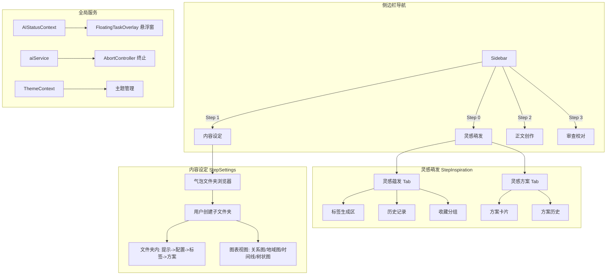
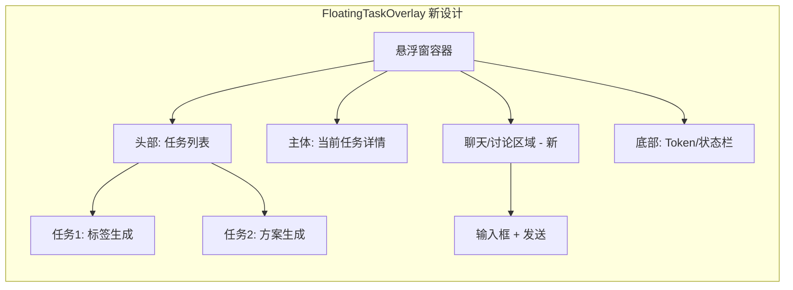
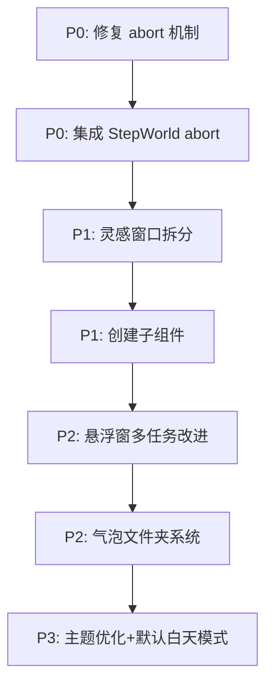

# 大规模重构实施计划

---

## 一、总体架构图



---

## 二、各需求详细方案

### 需求 1：灵感窗口拆分

#### 当前状态
[`StepInspiration.tsx`](src/renderer/features/inspiration/StepInspiration.tsx) 是一个 1315 行的巨型组件，包含三个阶段（input → tags → schemes）全部逻辑。

#### 目标架构

```
src/renderer/features/inspiration/
├── StepInspiration.tsx        # 容器组件，含 Tab 导航
├── InspirationIncubation.tsx  # 灵感蕴发模块（新文件）
├── InspirationSchemes.tsx     # 灵感方案模块（新文件）
├── inspirationService.ts     # 共享 AI 调用服务（已有）
└── components/
    ├── TagCloud.tsx           # 标签云/标签选择组件
    ├── SchemeCard.tsx         # 方案卡片组件
    ├── HistoryPanel.tsx       # 历史记录面板
    └── FavoritesPanel.tsx     # 收藏/分组面板
```

#### 灵感蕴发（InspirationIncubation）

| 区域 | 内容 | 说明 |
|------|------|------|
| 顶部 | 用户输入框 + 预设标签选择 + 标签生成数量设置 | 复用现有 `renderInputPhase` |
| 中部 | 标签生成区（标签云 Grid） | 复用现有标签渲染逻辑 |
| 中部 | 标签交互：收藏、分组、历史记录、刷新 | 独立状态管理 |
| 底部 | 用户已选中的标签（支持从历史记录选取） | 新功能：从历史回选标签 |

#### 灵感方案（InspirationSchemes）

| 区域 | 内容 | 说明 |
|------|------|------|
| 顶部 | 输入框 + 方案生成数量设置 | 复用现有逻辑 |
| 中部 | 方案卡片展示区（Grid/List 切换） | 复用现有 card 渲染 |
| 底部 | 历史记录、收藏等通用交互面板 | 与灵感蕴发共享逻辑 |

#### 关键状态分离

```typescript
// 灵感蕴发状态
interface IncubationState {
  input: string;
  generatedTags: InspirationTag[];
  selectedTags: InspirationTag[];
  tagCount: number;
  history: TagHistory[];
  favorites: TagFavorite[];
  isGenerating: boolean;
}

// 灵感方案状态  
interface SchemesState {
  input: string;
  schemes: NovelScheme[];
  schemeCount: number;
  history: SchemeHistory[];
  favorites: string[]; // scheme ids
  isGenerating: boolean;
}
```

### 需求 2：终止功能修复

#### 根因分析

[`aiService.ts`](src/renderer/shared/services/aiService.ts:194) 使用 `_activeController` 单一引用来跟踪当前的 AbortController：

```typescript
_activeController: null as AbortController | null,
abort(): void {
  if (this._activeController) {
    this._activeController.abort();
    this._activeController = null;
  }
}
```

**问题 1**：`generate()` 方法（第 211 行）在 fetch 完成后 `finally` 块中清空 `_activeController`。如果用户在请求已完成后快速调用 `abort()`，不会产生任何效果——但这时新请求可能已经开始，而 `abort()` 会错误地中断新请求。

**问题 2**：`inspirationService.ts` 中的 `generateTags()`（第 23 行）虽然接受 `signal` 参数，但实际调用 `aiService.generate()` 时并未传递该 signal，而是由 generate 内部创建新 controller。外部传入的 signal 形同虚设。

**问题 3**：`generateSchemes()`（第 78 行）没有接受 signal 参数，完全无法被外部中断。

**问题 4**：[`StepWorld.tsx`](src/renderer/features/world/StepWorld.tsx:249) 的 `handleAIGenerate` 没有 abort 支持。

#### 修复方案

```typescript
// aiService.ts 改进
export const aiService = {
  _controllers: new Map<string, AbortController>(), // 支持多任务追踪
  _nextId: 0,

  generate(config, taskId?: string): Promise<AIResponse> {
    const id = taskId || `task-${++this._nextId}`;
    const controller = new AbortController();
    this._controllers.set(id, controller);
    // ... fetch with controller.signal ...
    // finally: this._controllers.delete(id);
  },

  abort(taskId?: string): void {
    if (taskId) {
      this._controllers.get(taskId)?.abort();
      this._controllers.delete(taskId);
    } else {
      // 兼容旧调用：中止所有
      this._controllers.forEach(c => c.abort());
      this._controllers.clear();
    }
  },

  abortAll(): void {
    this._controllers.forEach(c => c.abort());
    this._controllers.clear();
  }
};
```

**各组件集成 abort**：

| 组件 | 修改内容 |
|------|---------|
| `inspirationService.ts:generateTags` | 使用 taskId 调用 aiService.generate() |
| `inspirationService.ts:generateSchemes` | 添加 signal 参数支持 |
| `StepWorld.tsx:handleAIGenerate` | 添加 abort 按钮，任务标识 |
| `FloatingTaskOverlay.tsx:handleAbort` | 使用 taskId 精确中止 |
| `StepInspiration.tsx:handleAbort` | 同步修改 |

### 需求 3：悬浮窗改进

#### 当前悬浮窗功能
- 显示 AI 生成进度、Token 用量、状态消息
- 支持点击展开/收起、长按拖拽
- 有中止按钮（调用 `aiService.abort()`）

#### 改进目标



#### 具体改进

1. **多任务支持**：`AIStatusContext` 改为支持多个并发任务列表
2. **内容讨论**：添加迷你聊天面板，用户可在生成过程中与 AI 对话调整方向
3. **Abort 修复**：精确中止当前任务而非全局

#### AIStatusContext 扩展

```typescript
interface AIStatusInfo {
  tasks: AITask[];  // 多任务列表
  activeTaskId: string | null;
}

interface AITask {
  id: string;
  type: 'generateTags' | 'generateSchemes' | 'generateWorldContent' | 'chat';
  modelName: string;
  status: 'running' | 'complete' | 'error' | 'aborted';
  statusMessage: string;
  progress: number;
  tokenUsage: TokenUsage | null;
  error: string | null;
  startTime: number;
}
```

### 需求 4：内容设定 - 气泡文件夹系统

#### 当前状态
[`StepSettings.tsx`](src/renderer/features/settings/StepSettings.tsx) 有 4 个硬编码子标签（world/characters/timeline/outline），各自渲染不同组件。

#### 目标：气泡文件夹浏览器

```
src/renderer/features/settings/
├── StepSettings.tsx           # 容器：文件夹浏览器
├── BubbleFolder.tsx           # 气泡文件夹组件（新）
├── BubbleFolderContent.tsx    # 文件夹内容（新）
├── folders/
│   ├── PromptConfigPanel.tsx  # 提示词配置面板（新）
│   ├── TagGeneration.tsx     # 标签生成面板（新）
│   └── SchemeGenerator.tsx   # 方案生成面板（新）
├── charts/
│   ├── CharacterRelationGraph.tsx  # 角色关系图（新）
│   ├── RegionMap.tsx               # 地域图（新）
│   ├── EventTimeline.tsx           # 事件时间线（新）
│   └── TreeDiagram.tsx             # 树状图（新）
├── StepWorld.tsx             # 世界观（已有，被文件夹引用）
├── StepCharacters.tsx        # 角色（已有，被文件夹引用）
├── StepOutline.tsx           # 大纲（已有，被文件夹引用）
└── StepReview.tsx            # 审查（已有）
```

#### 文件夹数据结构

```typescript
interface BubbleFolder {
  id: string;
  name: string;
  icon: string;
  color: string;
  parentId: string | null;  // 支持嵌套
  type: 'world' | 'characters' | 'timeline' | 'outline' | 'custom';
  // 通用流程数据
  prompt?: string;
  generatedTags?: InspirationTag[];
  selectedTags?: InspirationTag[];
  schemes?: NovelScheme[];
  // 图表配置
  charts?: ChartConfig[];
  createdAt: number;
}
```

#### 文件夹流程

```
进入文件夹 → 提示词配置 → AI生成标签 → 选择标签 → 生成方案 → 查看图表
    ↑_____________ 可回溯修改 _______________↓
```

### 需求 5：Bug 修复与 UI 优化

#### 5.1 API 配置去重

**当前问题**：
- 侧边栏 [`Sidebar.tsx:143`](src/renderer/app/app-shell/Sidebar.tsx:143) 有模型快速切换下拉框
- [`SettingsModal.tsx`](src/renderer/features/settings/SettingsModal.tsx) 有完整的模型管理（添加/删除/测试）
- 两处都可以配置 API，但 SettingsModal 是完整管理面板，Sidebar 只是快速切换

**修复方案**：
- 保留 SettingsModal 作为完整的模型管理入口
- Sidebar 的模型选择保持不变（快速切换是合理功能）
- 在 SettingsModal 中添加一个"设置"按钮跳转到完整的 SettingsModal（也就是统一管理入口）
- 或者将 Sidebar 的模型区域改为只读显示，点击跳转到 SettingsModal

**实际建议**：保持现状，因为 Sidebar 的快速切换和 SettingsModal 的完整管理是不同用途。只需在界面文案上明确区分。

#### 5.2 白天模式默认 + 主题优化

**当前问题**：
- [`ThemeContext.tsx`](src/renderer/shared/contexts/ThemeContext.tsx:59) 默认模式从 localStorage 读取，首次无存储时可能是深色
- 现有主题：purple, blue, emerald, amber, rose, gray, brown
- 用户反馈：风格不够高雅，缺乏文学气息

**修复方案**：

1. **默认白天模式**：
```typescript
// ThemeContext.tsx
const [mode, setModeState] = useState<ThemeMode>(() => {
  const saved = localStorage.getItem('theme-mode');
  return (saved as ThemeMode) || 'light'; // 改为 light
});
```

2. **新增文学主题**：
| 主题名 | 色调 | 适用场景 |
|--------|------|---------|
| 墨玉黑 (jade) | 暗绿-灰 | 沉稳文学风 |
| 宣纸白 (paper) | 米白-暖灰 | 古典文学风 |
| 竹青 (bamboo) | 青绿 | 自然清新风 |
| 朱砂红 (cinnabar) | 朱红-金 | 传统中国风 |
| 黛蓝 (indigo) | 靛蓝 | 典雅风 |

3. **CSS 变量增强**：在 [`index.css`](src/renderer/index.css) 中添加更多文学风格 CSS 变量

#### 5.3 其他 Bug 排查

| Bug | 位置 | 修复方式 |
|-----|------|---------|
| 标签徽章使用不存在 CSS 变量 | `StepWorld.tsx:382` | ✅ 已修复 |
| 步骤切换时状态丢失 | `StepInspiration.tsx:25-30` | 已有恢复逻辑，需验证 |
| 悬浮窗 abort 后状态不同步 | `FloatingTaskOverlay.tsx:140` | 见需求 2 修复 |
| 白天模式下某些文本对比度不足 | 全局排查 | 统一使用 `var(--color-text-*)` |

---

## 三、实施顺序



| 优先级 | 需求 | 预估文件数 | 依赖 |
|--------|------|-----------|------|
| **P0** | Abort 机制修复（aiService.ts + 各调用方） | 5 文件 | 无 |
| **P1** | 灵感窗口拆分（StepInspiration 重构） | 6 文件 | P0 |
| **P2** | 悬浮窗多任务 + 讨论功能 | 3 文件 | P0 |
| **P3** | 气泡文件夹系统 | 8-12 文件 | P1, P2 |
| **P4** | 主题优化 + 白天模式默认 | 3 文件 | 无 |

---

## 四、风险与注意事项

1. **StepInspiration.tsx 1315 行**：拆分时需确保不破坏现有功能，建议逐个函数迁移
2. **气泡文件夹**：这是最大的新功能，建议先实现基础文件夹结构，再逐步添加图表
3. **Abort 机制**：修改 `_activeController` 为 Map 结构需确保所有调用方同步更新
4. **主题变更**：改默认 mode 为 light 需验证所有组件在白天模式下的表现
5. **Backward Compatibility**：现有用户数据（localStorage）需兼容新文件夹结构
