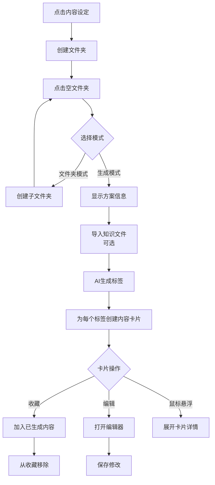
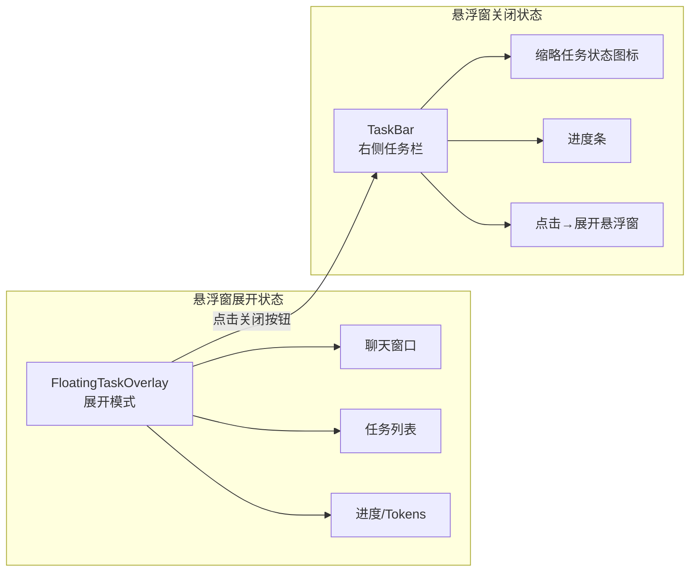
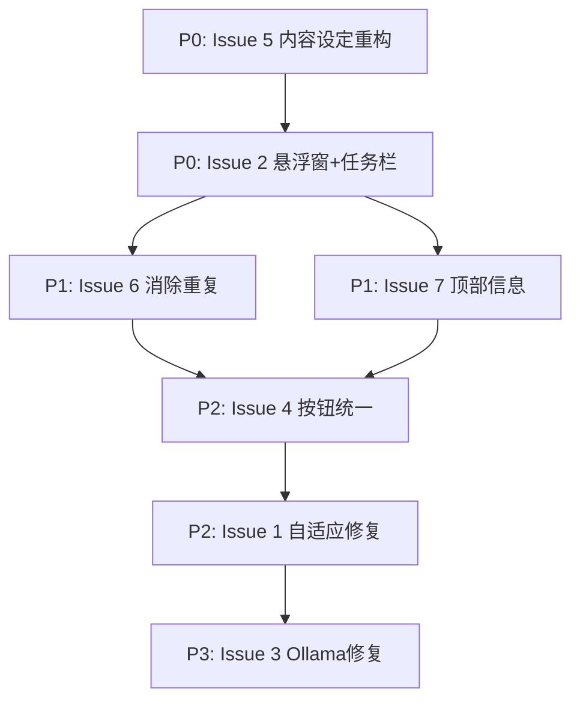

# 墨渊灵笔 - 第二阶段重构计划

> 基于用户 7 项反馈的核心问题分析，制定分优先级、可执行的重构方案。

---

## 目录

1. [问题总览与优先级](#1-问题总览与优先级)
2. [P0 - 最紧急](#2-p0---最紧急)
   - [Issue 5: 内容设定流程重构](#21-issue-5-内容设定流程重构)
   - [Issue 2: 悬浮窗关闭按钮bug + 右侧任务栏](#22-issue-2-悬浮窗关闭按钮bug--右侧任务栏)
3. [P1 - 重要](#3-p1---重要)
   - [Issue 6: 消除设置/模型配置重复](#31-issue-6-消除设置模型配置重复)
   - [Issue 7: 顶部信息栏优化](#32-issue-7-顶部信息栏优化)
4. [P2 - 常规](#4-p2---常规)
   - [Issue 4: AI生成按钮位置统一](#41-issue-4-ai生成按钮位置统一)
   - [Issue 1: UI尺寸自适应bug修复](#42-issue-1-ui尺寸自适应bug修复)
5. [P3 - 低优先级](#5-p3---低优先级)
   - [Issue 3: Ollama连接测试修复](#51-issue-3-ollama连接测试修复)
6. [步骤配置变更总览](#6-步骤配置变更总览)

---

## 1. 问题总览与优先级

| 优先级 | Issue | 影响面 | 复杂度 |
|--------|-------|--------|--------|
| **P0** | 5. 内容设定流程错误 | 核心功能流程完全错误 | 🔴 极高 |
| **P0** | 2. 悬浮窗关闭按钮bug+右侧任务栏 | 用户交互核心障碍 | 🟡 中 |
| **P1** | 6. 设置/模型配置重复 | 用户体验混乱 | 🟢 低 |
| **P1** | 7. 顶部信息栏空白 | 信息缺失 | 🟢 低 |
| **P2** | 4. AI生成按钮位置不一致 | UI不一致 | 🟢 低 |
| **P2** | 1. UI尺寸自适应bug | 响应式问题 | 🟡 中 |
| **P3** | 3. Ollama连接测试失败 | 特定提供商问题 | 🟡 中 |

---

## 2. P0 - 最紧急

### 2.1 Issue 5: 内容设定流程重构

#### 当前问题

当前 [`BubbleFolderContent.tsx`](src/renderer/features/settings/BubbleFolderContent.tsx:236) 采用 **3标签页结构**（生成/已生成内容/图表），与用户期望的"文件夹模式 vs 生成模式"双模式选择完全不符。

#### 用户期望的正确流程

```
灵感萌发 (step 0)
  ├── 灵感萌发（标签生成）
  └── 灵感方案（方案生成与选择）
        ↓ 选择方案后
内容设定 (step 1)
  └── 气泡文件夹系统
        ├── 创建文件夹（支持文件夹套文件夹）
        └── 点击空文件夹 → 双模式选择:
              ├── 📁 文件夹模式 → 简单嵌套子文件夹
              └── 🔧 生成模式 → 
                    ├── 顶部: 已选灵感方案信息 + 知识输入（文件导入）
                    ├── 中部: AI生成标签（类似灵感萌发的标签生成）
                    └── 底部: 每个标签→内容卡片
                          ├── 可编辑
                          ├── 可收藏到"已生成内容"
                          └── 鼠标悬浮展开详情
```

#### 需要变更的文件

| 文件 | 变更类型 | 说明 |
|------|----------|------|
| [`BubbleFolderContent.tsx`](src/renderer/features/settings/BubbleFolderContent.tsx) | **重写** | 从3标签页改为双模式选择 + 生成模式工作流 |
| [`BubbleFolder.tsx`](src/renderer/features/settings/BubbleFolder.tsx) | 修改 | 支持文件夹内嵌子文件夹 |
| [`StepSettings.tsx`](src/renderer/features/settings/StepSettings.tsx) | 修改 | 调整布局以支持递归文件夹 |
| [`BubbleFolder`](src/shared/types/index.ts:209) 类型 | 扩展 | 添加子文件夹字段, 内容卡片字段 |
| **新建**: `ContentCard.tsx` | 新建 | 内容卡片组件（悬浮展开、编辑、收藏） |
| **新建**: `GenerateModeView.tsx` | 新建 | 生成模式主视图 |
| **新建**: `ContentCardViewer.tsx` | 新建 | 已生成内容查看器 |

#### 接口变更

```typescript
// 扩展 BubbleFolder 类型
interface BubbleFolder {
  // ...现有字段
  children?: BubbleFolder[];  // 子文件夹（支持嵌套）
  mode?: 'folder' | 'generate';  // 文件夹模式/生成模式
  selectedSchemeId?: string;  // 关联的灵感方案ID
  knowledgeInputs?: KnowledgeItem[];  // 知识输入
  contentCards?: ContentCard[];  // 生成的内容卡片
}

// 新增内容卡片类型
interface ContentCard {
  id: string;
  tagText: string;  // 关联的标签文本
  title: string;
  content: string;
  isFavorited: boolean;
  createdAt: number;
  updatedAt: number;
}
```

#### 生成模式视图 UI 架构

```
┌──────────────────────────────────────┐
│ 🔧 生成模式                            │
├──────────────────────────────────────┤
│ ┌─ 使用信息 ──────────────────────┐  │
│ │ 方案: [仙侠世界修炼体系构建方案]     │  │
│ │ 知识输入: [+导入文件]            │  │
│ └──────────────────────────────────┘  │
│ ┌─ AI生成标签 ──────────────────────┐ │
│ │ [提示词输入框...]    [数量: 5]     │ │
│ │ [✨ AI生成]                       │ │
│ │ ┌── 标签云 ──────────────────┐    │ │
│ │ │ #昆仑山 #筑基境 #飞升台     │    │ │
│ │ │ #灵脉 #金丹大道            │    │ │
│ │ └────────────────────────────┘    │ │
│ └──────────────────────────────────┘  │
│ ┌─ 标签内容卡片 ────────────────────┐ │
│ │ 📍 昆仑山                        │ │
│ │ ┌──────────────────────────────┐ │ │
│ │ │ 位置描述: 西昆仑之巅...  [编辑]│ │ │
│ │ │ 🌟 收藏  ✏️ 编辑  🔍 展开     │ │ │
│ │ └──────────────────────────────┘ │ │
│ │ 📍 筑基境                        │ │
│ │ ┌──────────────────────────────┐ │ │
│ │ │ 修炼境界: 筑基期需...    [编辑]│ │ │
│ │ │ 🌟 收藏  ✏️ 编辑  🔍 展开     │ │ │
│ │ └──────────────────────────────┘ │ │
│ └──────────────────────────────────┘  │
└──────────────────────────────────────┘
```

#### 流程图



---

### 2.2 Issue 2: 悬浮窗关闭按钮bug + 右侧任务栏

#### 当前问题

1. 悬浮窗右侧关闭按钮 `×` 点击逻辑有 bug（根据之前的反馈，点击关闭会收缩/展开混乱）
2. 悬浮窗关闭后，右侧没有替代的显示区域，用户无法感知 AI 任务状态

#### 需求

- 修复关闭按钮 bug
- 悬浮窗关闭后 → 右侧显示一个 **大任务栏**（垂直长条），展示：
  - 当前 AI 任务状态（进度、消息）
  - Token 用量
  - 点击可重新展开悬浮窗

#### 变更文件

| 文件 | 变更类型 | 说明 |
|------|----------|------|
| [`FloatingTaskOverlay.tsx`](src/renderer/shared/components/FloatingTaskOverlay.tsx) | 修改 | 修复关闭逻辑; 新增"紧凑模式" |
| **新建**: `TaskBar.tsx` | 新建 | 右侧垂直任务栏组件 |

#### 架构设计



#### TaskBar 设计

```
┌──────┐
│  🤖  │ ← AI 图标（动画表示活跃）
│  ██  │
│  ██  │ ← 进度条（垂直）
│  ██  │
│  🪪  │ ← 任务数
│──────│
│  1.2K│ ← Token计数
│──────│
│  ⚡  │ ← 点击展开
└──────┘
```

---

## 3. P1 - 重要

### 3.1 Issue 6: 消除设置/模型配置重复

#### 当前问题

- [`Sidebar.tsx`](src/renderer/app/app-shell/Sidebar.tsx:221) 底部有 **设置按钮**（`fa-cog`）
- [`App.tsx`](src/renderer/app/App.tsx:437) 顶部 header 也有 **模型选择 + 设置按钮**
- 两者功能重复，用户感到困惑

#### 解决方案

**方案选择：保留 header 设置，精简 sidebar**

| 文件 | 变更 |
|------|------|
| [`Sidebar.tsx`](src/renderer/app/app-shell/Sidebar.tsx) | 移除底部"设置"按钮（`fa-cog`）及相关设置弹窗逻辑；只保留步骤导航和作品列表 |
| [`App.tsx`](src/renderer/app/App.tsx) | header 保留模型选择和设置按钮，作为唯一的设置入口 |

#### Sidebar 清理后结构

```
┌──────────────┐
│  墨渊灵笔     │ ← Logo
│──────────────│
│  📖 作品列表  │
│  ├ 测试作品   │
│  └ 新建作品   │
│──────────────│
│  💡 灵感萌发  │ ← 步骤导航
│  🔧 内容设定  │
│  ✍️ 情节创作  │
│  ✅ 审查校对  │
│──────────────│
│  ← 这是关键   │ ← 版本号
└──────────────┘
```

---

### 3.2 Issue 7: 顶部信息栏优化

#### 当前问题

当前 [`App.tsx`](src/renderer/app/App.tsx:414) header 只显示模型选择和设置按钮，大量空间空白。

#### 解决方案

在 header 中添加有用信息：

```
┌─────────────────────────────────────────────────────┐
│ 💡 灵感萌发        模型: [gpt-4o ▼]  [⚙️]  [🌙]   │
│ 作品: 仙侠奇缘  字数: 12,345  章节: 8  角色: 15   │
└─────────────────────────────────────────────────────┘
```

#### 变更文件

| 文件 | 变更 |
|------|------|
| [`App.tsx`](src/renderer/app/App.tsx:414) | Header 添加当前步骤标题、作品统计信息 |
| [`StatusBar.tsx`](src/renderer/shared/components/StatusBar.tsx) | 可考虑合并到 header 或保持独立 |

---

## 4. P2 - 常规

### 4.1 Issue 4: AI生成按钮位置统一

#### 当前问题

- [`InspirationSchemes.tsx`](src/renderer/features/inspiration/InspirationSchemes.tsx:602) - AI生成按钮 **在卡片框架内部**
- [`InspirationIncubation.tsx`](src/renderer/features/inspiration/InspirationIncubation.tsx:229) - AI生成按钮 **在卡片框架外部**（独立的 div）

#### 解决方案

将 [`InspirationIncubation.tsx`](src/renderer/features/inspiration/InspirationIncubation.tsx) 的"AI生成"按钮（`✨AI生成`）从外部移到 `glass-card` 框架内部，与 InspirationSchemes 保持一致的布局模式。

---

### 4.2 Issue 1: UI尺寸自适应bug修复

#### 当前问题

App 在窗口缩放时布局出现错乱，具体表现为：
- 元素溢出
- 内容重叠
- flex 布局计算错误

#### 可能的根因

1. 某些容器缺少 `overflow-hidden` 或 `min-width: 0`
2. flex-shrink 未正确设置
3. 固定宽度（如 `w-64` sidebar, `w-72` 右侧面板）在小窗口时导致溢出

#### 修复策略

| 文件 | 可能的修复 |
|------|-----------|
| [`App.tsx`](src/renderer/app/App.tsx:395) | 确保 `main` 区域 `min-width: 0`, `overflow-hidden` |
| [`Sidebar.tsx`](src/renderer/app/app-shell/Sidebar.tsx:70) | sidebar 添加响应式宽度（`w-64 lg:w-56 xl:w-64`） |
| [`FloatingTaskOverlay.tsx`](src/renderer/shared/components/FloatingTaskOverlay.tsx) | 确保 max-width/max-height 限制 |
| [`index.css`](src/renderer/index.css) | 全局添加 `* { min-width: 0 }` 或针对性修复 |
| 各卡片组件 | 添加 `max-w-full`, `break-words`, `truncate` |

---

## 5. P3 - 低优先级

### 5.1 Issue 3: Ollama连接测试修复

#### 当前问题

- [`fetchAvailableModels`](src/renderer/shared/services/aiService.ts:414) 成功（使用 `/api/tags` 端点）
- [`testConnection`](src/renderer/shared/services/aiService.ts:346) 失败（使用 `/v1/chat/completions` 端点）
- 原因可能是 Ollama 的 OpenAI 兼容端点需要特定格式

#### 调试方向

1. 检查 [`getDefaultEndpoint('ollama')`](src/renderer/shared/services/aiService.ts:29) 返回值是否正确（应该是 `http://127.0.0.1:11434/v1`）
2. 检查 [`buildChatCompletionsRequest`](src/renderer/shared/services/aiService.ts:45) 构造的请求体是否符合 Ollama 要求
3. Ollama 的 OpenAI 兼容 API 需要 `model` 字段不能包含标签名（如 `llama3.2:3b` 需要是 `llama3.2`）
4. Ollama 可能返回 HTTP 200 但 body 含 error 对象——已修复，但需验证

---

## 6. 步骤配置变更总览

### App 步骤映射

| 步骤索引 | 当前名称 | 新名称 | 组件 | 变更 |
|----------|---------|--------|------|------|
| 0 | 灵感萌发 | **灵感萌发**（不变） | [`StepInspiration`](src/renderer/features/inspiration/StepInspiration.tsx) | 微调：统一 AI 按钮位置 |
| 1 | 内容设定 | **内容设定**（不变） | [`StepSettings`](src/renderer/features/settings/StepSettings.tsx) | **大重构**：双模式、内容卡片 |
| 2 | 正文创作 | **情节创作** | [`StepPlotOutline`/`StepChapterOutline`/`WritingEditor`](src/renderer/features/chapters) | 重命名 + 添加大纲（plot outline）部分 |
| 3 | 审查校对 | **审查校对**（不变） | [`StepReview`](src/renderer/features/review/StepReview.tsx) | 重构为：检查（各种检查）— 小说信息（统计信息） |

### Sidebar 步骤更新

```typescript
const steps = [
  { id: 0, icon: 'fa-lightbulb', label: '灵感萌发' },
  { id: 1, icon: 'fa-sliders', label: '内容设定' },
  { id: 2, icon: 'fa-pen-nib', label: '情节创作' },  // 原"正文创作"
  { id: 3, icon: 'fa-check-double', label: '审查校对' },
];
```

---

## 执行顺序建议



> **建议严格按此顺序执行**，因为 Issue 5 是最根本的架构变化，会影响其他所有 UI 调整。
